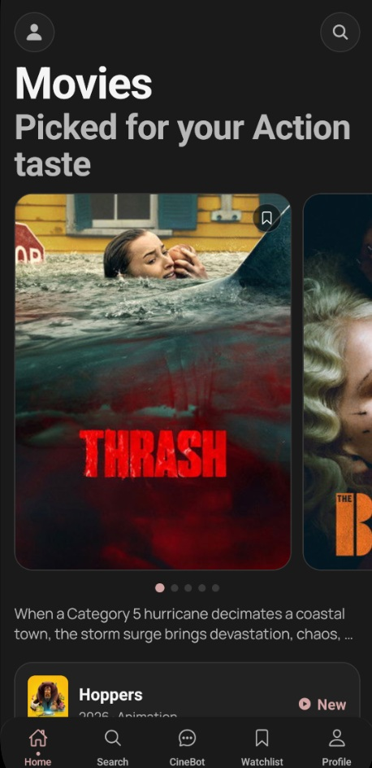

# CineMatch

Smart mobile movie recommendation app built to reduce decision fatigue across streaming platforms.



## Overview

CineMatch is a mobile-first movie discovery and recommendation system designed for users who spend too much time browsing and too little time actually watching. The app combines personalized onboarding, smart search, AI-assisted conversation, rich movie detail pages, and a persistent watchlist to help users quickly discover movies that match their mood, language, genre, and platform preferences.

This project was built as a React Native + Expo mobile application with a FastAPI backend that supports CineBot, movie data access, preference sync, and watchlist operations.

## Problem Statement

With the rapid growth of digital streaming platforms, users are faced with an overwhelming number of movies across different genres, languages, and platforms. Many users spend more time searching and browsing than actually watching a movie, leading to frustration and decision fatigue.

CineMatch solves this by acting as a smart recommendation layer that helps users:

- discover relevant movies faster
- narrow down options using onboarding preferences
- get AI-assisted recommendations using natural prompts
- save and revisit promising movies through a watchlist
- receive more relevant suggestions over time using feedback signals

## Key Features

- Personalized onboarding for languages, genres, moods, and platforms
- Smart Home feed with preference-aware movie sections
- Debounced search with typo recovery, recent searches, and trending suggestions
- CineBot conversational movie assistant with retry and fallback behavior
- Rich movie detail screen with trailer, cast, similar titles, and availability
- Watchlist with sorting, reminders, and persistent state
- Personalization feedback loop:
  - Not interested
  - More like this
  - Seen already
- Offline/degraded UX states with cache fallback
- Analytics and lightweight KPI tracking
- Clean custom design system with mobile-first navigation and interactions

## Why This App Is Different

CineMatch is not just a basic movie search interface. It is a guided decision-support product.

What makes it stand out:

- It combines browse, search, AI conversation, and watchlist in one flow
- It supports Indian usage patterns with Hindi-friendly discovery and platform-aware preferences
- It reduces cognitive overload with guided intent chips and curated recommendation rails
- It learns from explicit user feedback instead of staying static
- It is mobile-first in layout, interactions, and performance tuning
- It includes fallback and reliability logic, making it more practical than a demo-only prototype

## Tech Stack

### Mobile App

- React Native
- Expo
- Expo Router
- TypeScript
- React Native Paper
- Reanimated
- Zustand
- AsyncStorage
- Axios

### Backend

- FastAPI
- Uvicorn
- Pydantic Settings
- OpenAI-compatible client for NVIDIA NIM
- HTTPX

### External Services

- TMDB for movie metadata and discovery
- NVIDIA NIM for CineBot conversational recommendations

## Project Structure

```text
CineMatch/
├── apps/
│   └── mobile/
│       ├── app/
│       │   ├── _layout.tsx
│       │   ├── onboarding.tsx
│       │   ├── +not-found.tsx
│       │   ├── (tabs)/
│       │   │   ├── _layout.tsx
│       │   │   ├── index.tsx
│       │   │   ├── search.tsx
│       │   │   ├── cinebot.tsx
│       │   │   ├── watchlist.tsx
│       │   │   └── profile.tsx
│       │   └── movie/
│       │       └── [id].tsx
│       ├── assets/
│       ├── components/
│       ├── constants/
│       ├── services/
│       │   ├── api.ts
│       │   ├── analytics.ts
│       │   ├── cache.ts
│       │   ├── experiments.ts
│       │   ├── feedback.ts
│       │   ├── preferences.ts
│       │   └── searchHistory.ts
│       ├── stores/
│       │   ├── appStatus.ts
│       │   ├── personalizationFeedback.ts
│       │   ├── preferences.ts
│       │   └── watchlist.ts
│       ├── theme/
│       │   ├── colors.ts
│       │   ├── index.ts
│       │   ├── spacing.ts
│       │   └── typography.ts
│       ├── android/
│       ├── app.json
│       ├── package.json
│       └── tsconfig.json
├── server/
│   ├── app/
│   │   ├── main.py
│   │   ├── config.py
│   │   └── routers/
│   │       ├── cinebot.py
│   │       ├── movies.py
│   │       ├── ratings.py
│   │       ├── users.py
│   │       └── watchlist.py
│   ├── .env
│   └── requirements.txt
├── docs/
│   └── CineMatch.jpg
├── scripts/
│   └── generate_project_review_pdf.py
├── CineMatch-Project-Review.pdf
└── DEVELOPMENT-PROGRESS.md
```

## Folder Explanation

- `apps/mobile/app`: all screens and navigation routes
- `apps/mobile/services`: reusable API, cache, analytics, and preference logic
- `apps/mobile/stores`: shared app state using Zustand
- `apps/mobile/theme`: centralized design system tokens and Paper theme
- `server/app/routers`: backend endpoints by feature area
- `docs`: static documentation assets such as screenshots
- `scripts`: utility scripts such as the PDF review generator

## How It Works

### 1. User Preference Capture

When the user opens the app for the first time, CineMatch asks for:

- preferred languages
- favorite genres
- moods
- streaming platforms

These preferences are saved locally and can also be synced to the backend.

### 2. Personalized Discovery

The Home screen uses saved preferences and feedback signals to show more relevant content. Instead of showing one flat list, the app organizes discovery into usable sections such as:

- Trending
- Top Rated
- Popular in Hindi
- Trailer highlight cards

### 3. Smart Search

Users can search by title or browse by genre, with:

- debounced live search
- stale request protection
- recent query history
- trending suggestions
- typo correction support

### 4. CineBot

CineBot allows the user to ask for recommendations in natural language, including Hindi/Hinglish-style prompts. Example requests:

- funny Hindi movies
- something like Inception
- family movie under 2 hours
- underrated thriller for tonight

If the AI provider is slow or unavailable, the app falls back gracefully instead of freezing the UI.

### 5. Decision Conversion

On the movie detail screen, the user can quickly evaluate a recommendation through:

- trailer access
- cast information
- genres and runtime
- streaming availability
- similar picks
- “because you like this” rails

### 6. Retention Through Watchlist

The watchlist helps users preserve decisions and return later instead of restarting discovery from scratch.

## How This Solves the Problem Statement

The app directly addresses the movie overload problem in these ways:

- It reduces irrelevant browsing by filtering based on stated preferences
- It lowers decision fatigue by presenting curated and guided options
- It shortens time-to-choice using conversation, search, and recommendation rails
- It improves confidence using detail screens with context and availability
- It gets smarter over time through watchlist and feedback behavior

## Performance and Reliability

- TypeScript validation is in place for the mobile app
- Expo Doctor checks pass
- Backend compiles successfully
- TMDB responses are cached in memory for smoother repeat usage
- Search requests are debounced to reduce UI thrash
- CineBot uses timeout + fallback behavior for better reliability
- Main lists were tuned for smoother Android scrolling

## Running the Project

### Mobile App

```bash
cd apps/mobile
npm install
npx expo start
```

### Backend

```bash
cd server
pip install -r requirements.txt
uvicorn app.main:app --host 0.0.0.0 --port 8000
```

## Included Documentation

- `CineMatch-Project-Review.pdf`: detailed project review document
- `DEVELOPMENT-PROGRESS.md`: implementation progress summary

## Author

Aryan Yadav

